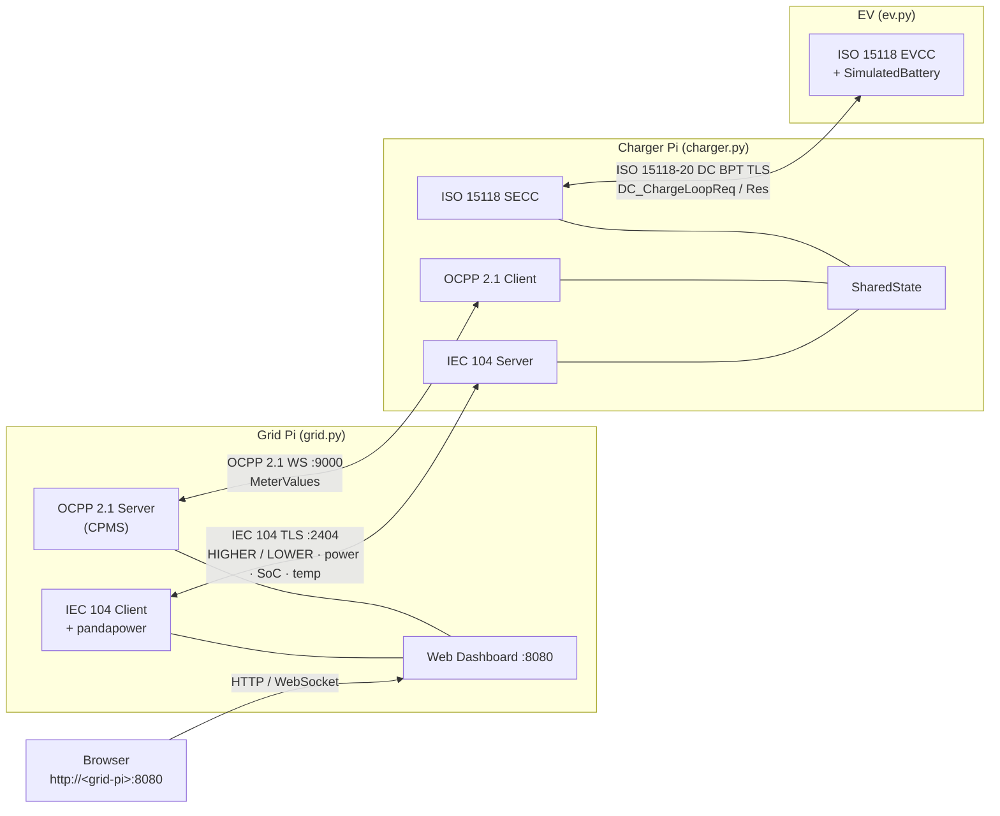
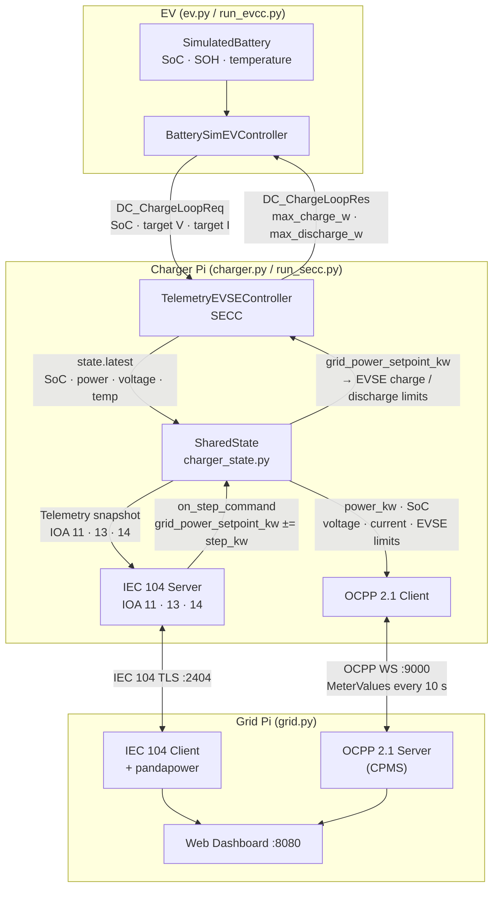
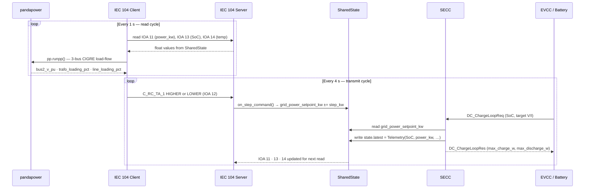

# UoL V2G Communication Protocol Prototype

A Python prototype for bidirectional Vehicle-to-Grid (V2G) energy exchange. Two Raspberry Pis communicate over three industrial protocols to enable real-time monitoring and grid-driven control of EV charging and discharge.

---

## Overview

Two physical nodes run concurrently:

| Node | Role | Protocols |
|------|------|-----------|
| **Grid Pi** | Grid operator | IEC 104 client + OCPP 2.1 server + web dashboard |
| **Charger Pi** | EV charger (SECC) + EV simulator (EVCC) | IEC 104 server + OCPP 2.1 client + ISO 15118 |

The grid Pi runs a pandapower load-flow on a 3-bus CIGRE network every second and sends HIGHER/LOWER step commands over IEC 104. The charger Pi translates those commands into EVSE charge-loop limits that the EV respects via ISO 15118 DC BPT.



---

## Tech Stack

- **Language**: Python 3.11 (`c104` has issues on 3.13+)
- **Protocols**:
  - **IEC 60870-5-104** (`c104`): SCADA link — grid operator controls charger
  - **OCPP 2.1** (`ocpp` + `websockets`): Charge point telemetry to CPMS
  - **ISO 15118-20 DC BPT** (Josev + custom controllers): In-cable EV↔EVSE negotiation
- **Key libraries**: `pandapower`, `fastapi`, `uvicorn`, `asyncio`

---

## Project Structure

```text
.
├── grid.py                     # Grid Pi entry point (IEC 104 client + OCPP server + dashboard)
├── charger.py                  # Charger Pi entry point — shells out to run_secc.py via Poetry
├── ev.py                       # EV entry point — shells out to run_evcc.py via Poetry
├── config.py                   # Shared config: IPs, ports, IOAs
├── code_battery_sim/           # Battery models and CSV discharge profiles
├── code_charger/iso15118/      # Josev ISO 15118 submodule (unmodified)
├── code_cpms/                  # OCPP charge point and central system
├── code_grid/                  # IEC 104 client, pandapower grid model, web dashboard
├── code_iso15118_custom/       # Custom ISO 15118 controllers and launchers
│   ├── charger_state.py        # SharedState singleton (bridges all three protocols)
│   ├── simulated_battery.py    # SimulatedBattery: coulomb-counting SoC, SOH, thermal model
│   ├── telemetry_evse_controller.py  # SECC: forwards telemetry, relays grid setpoint
│   ├── battery_ev_controller.py      # EVCC: drives SoC from battery model
│   ├── run_secc.py             # Charger Pi launcher (full mode)
│   └── run_evcc.py             # EV simulator launcher (full mode)
├── tools/                      # Offline evaluation and analysis tools
│   ├── reliability_test.sh     # Inject packet loss via tc netem for stress testing
│   ├── analyse_reliability.py  # Parse IEC 104 CSVs and print delivery-rate table
│   ├── multi_ev_sim.py         # Discrete-event multi-EV fleet simulation (--no-v2g flag for baseline)
│   ├── battery_degradation.py  # SOH degradation comparison: charge-only vs V2G scenarios
│   ├── resource_monitor.py     # Log CPU % and memory during a live session (psutil)
│   └── plot_results.py         # Generate all dissertation figures from Logs/ CSVs
└── code_ev/                    # Placeholder (empty)
```

---

## Requirements

- Python 3.11
- `pip install ocpp c104 websockets pandapower pandas fastapi uvicorn`
- `pip install matplotlib numpy psutil`  (evaluation tools only)
- `c104` may require C++ build tools on some platforms

For ISO 15118 full mode, the Josev submodule needs Poetry:
```bash
cd code_charger/iso15118
poetry install
cd iso15118/shared/pki && ./create_certs.sh -v iso-2   # one-time
```

---

## Running

### Certificate generation (one-time, run from project root)

```bash
./create_ocpp_certs.sh          # OCPP mTLS (Security Profile 3)
./create_iec104_certs.sh        # IEC 104 TLS (IEC 62351-3)
# Copy certs/ to both Pis.
```

### Simple mode (IEC 104 + OCPP, no ISO 15118)

```bash
# Grid Pi — web dashboard at http://<grid-pi-ip>:8080
python grid.py

# Charger Pi
python charger.py
```

### Full ISO 15118 mode

```bash
# Charger Pi — SECC (ISO 15118 server + IEC 104 server + OCPP client)
python charger.py

# EV — EVCC (ISO 15118 client + battery simulation)
python ev.py
```

Both launchers set `PYTHONPATH` and invoke the appropriate script under the `code_charger/iso15118` Poetry environment automatically. All `EVCC_*` environment variables are forwarded.

EVCC environment variables:

| Variable | Default | Effect |
|----------|---------|--------|
| `EVCC_CONTROLLER` | `battery` | Battery model: `battery`, `battery_csv`, `sim` |
| `EVCC_PROFILE_PATH` | built-in LFP | Path to CSV profile override |
| `EVCC_MAX_STEPS` | unlimited | Cap charge loop iterations for bounded tests |
| `EVCC_INIT_SETPOINT_KW` | `17.0` | Initial charge power before first IEC 104 command |
| `EVCC_TARGET_SOC` | `80.0` | SoC % at which `SimulatedBattery.at_end()` returns True |

### ISO 15118 submodule tests / lint

```bash
cd code_charger/iso15118
make test           # poetry run pytest --cov
make mypy           # type checking
make code-quality   # reformat + mypy + flake8
```

---

## Architecture

### SharedState data flow (Charger Pi)

All three protocol stacks on the charger Pi converge on a single `SharedState` singleton. The diagram below shows how telemetry and control signals move through it.



### IEC 104 control loop

The grid Pi runs two interleaved loops. The 1 s read cycle updates the pandapower model; the 4 s transmit cycle sends a step command when the grid state or battery SoC warrants it.



### SharedState fields (`charger_state.py`)

`code_iso15118_custom/charger_state.py` exports a module-level singleton `state`. All three protocol layers share it:

| Field | Set by | Read by | Description |
|-------|--------|---------|-------------|
| `state.latest` | SECC (`send_charging_command`) | IEC 104 server, OCPP client | Immutable `Telemetry` snapshot: SoC, power_kw, voltage_v, current_a, soh_percent, temperature_c |
| `state.grid_power_setpoint_kw` | IEC 104 server (`on_step_command`) | SECC | Target power; clamped to `[-max_discharge_kw, +max_charge_kw]` |
| `state.command_received` | IEC 104 server (first command) | SECC | Guards against spurious full-power spike when setpoint crosses zero |
| `state.iso_evse_max_charge_w` / `_discharge_w` | SECC (`DC_ChargeLoopRes`) | OCPP client | Last EVSE limits written into the charge-loop response |
| `state.step_kw` | config (default 5.0) | IEC 104 server | Step size per HIGHER/LOWER command |
| `state.max_charge_kw` | config (default 300.0) | SECC, IEC 104 server | Maximum charge power |
| `state.max_discharge_kw` | config (default 20.0) | SECC, IEC 104 server | Maximum V2G discharge power |

**Sign convention:** positive power = charging (grid → EV); negative power = V2G discharge (EV → grid).

### IEC 104 IOA map (`config.py`)

| IOA | Type | Direction | Meaning |
|-----|------|-----------|---------|
| 11 | M_ME_NC_1 | server → client | Active power [kW] |
| 12 | C_RC_TA_1 | client → server | Regulating step command (HIGHER / LOWER) |
| 13 | M_ME_NC_1 | server → client | State of Charge [%] |
| 14 | M_ME_NC_1 | server → client | Connector temperature [°C] (RC thermal model) |
| 15 | M_ME_NC_1 | server → client | EV target voltage [V] |
| 16 | M_ME_NC_1 | server → client | EV target current [A] |
| 17 | M_ME_NC_1 | server → client | ISO 15118 charge-loop processing time [ms] |

### Grid control logic (`iec104_panda.py`)

Three control branches evaluated in priority order every 4 s transmit cycle:

**1. Manual override** (`auto_control = False`) — dashboard button forces HIGHER or LOWER regardless of grid state.

**2. Voltage stabilisation mode** (`voltage_stab_mode = True`) — injects a ±40 kW sine-wave background load at bus 3 (period 60 s), then applies voltage-droop control:

| Condition | Command | Rationale |
|-----------|---------|-----------|
| SoC < min_soc_pct | HOLD | Battery floor — refuse V2G discharge |
| bus 2 voltage < 0.972 pu | HIGHER | Droop: discharge EV → power to grid → voltage rises |
| bus 2 voltage > 0.978 pu | LOWER | Droop: charge EV → absorbs power → voltage falls |
| 0.972–0.978 pu dead zone | HOLD | Hysteresis — avoids chattering |

Target voltage: 0.975 pu; deadband: ±0.003 pu. Burst count scales with deviation depth (1×/2×/4×).

**3. Auto — trafo/line threshold control** (default):

| Priority | Condition | Command | Rationale |
|----------|-----------|---------|-----------|
| 1 | trafo > 80 % or line > 90 % or bus voltage < 0.95 pu | HIGHER | Grid emergency — overrides all prefs |
| 2 | SoC > max_soc_pct (default 80 %) | HIGHER | Battery at user ceiling — ramp down |
| 3 | SoC < min_soc_pct (default 20 %) | LOWER | Battery at user floor — charge unconditionally |
| 4 | Departure < 60 min and SoC < target SoC | LOWER | Charge priority when grid is not stressed |
| 5 | trafo > 73 % or line > 85 % | HIGHER | Approaching capacity — reduce charge |
| 5 | trafo < 67 % and line < 75 % | LOWER | Spare capacity — increase charge |
| 5 | dead zones 67–73 % / 75–85 % | HOLD | Hysteresis band — skip transmit |

HIGHER commands are also blocked on the SECC side when SoC floor or departure conditions apply, enforcing the guard at both the command-generation and command-receipt layers.

---

## Web Dashboard

Served at `http://<grid-pi-ip>:8080` by `code_grid/web_dashboard.py` (FastAPI, port 8080).

### Endpoints

| Endpoint | Purpose |
|----------|---------|
| `GET /` | HTML dashboard page |
| `WS /ws` | Pushes full JSON state every 500 ms |
| `POST /api/control` | `{"action": "auto"|"v2g"|"charge"|"voltage_stab"}` |
| `POST /api/tariff` | `{"charge_pence_per_kwh": float, "v2g_pence_per_kwh": float}` |
| `POST /api/preferences` | SoC limits and departure time; pushed to charger via OCPP SetVariables |
| `GET /api/perf/summary` | Full session performance statistics as JSON |
| `GET /api/perf/csv/{name}` | Download a log CSV (`iec104`, `ocpp`, or `iso15118`) |

### Control modes

| Mode | `POST /api/control` action | Behaviour |
|------|---------------------------|-----------|
| Auto | `"auto"` | pandapower trafo/line threshold control |
| Force V2G | `"v2g"` | Manual continuous HIGHER |
| Force Charge | `"charge"` | Manual continuous LOWER |
| Voltage Stabilisation | `"voltage_stab"` | Sine-wave disturbance + droop control to 0.975 pu |

### Dashboard cards

- **Power Flow** — IEC 104 active power with charge/V2G direction; OCPP power and energy
- **State of Charge** — SoC bar (IEC 104 + OCPP), temperature
- **Grid Health** — bus voltage, trafo %, line % from pandapower; voltage target and background disturbance load in voltage stabilisation mode
- **Power History** — 60 s rolling Chart.js line chart (IEC 104 kW)
- **Protocol Timing** — IEC 104 read, pandapower compute, and transmit latencies (live, current cycle)
- **ISO 15118 Charge Loop** — EV voltage, current, V×I power; EVSE max charge / discharge limits from `DC_ChargeLoopRes`
- **Security Status** — per-protocol TLS status: lock icon, TLS version, cert expiry
- **Session Billing** — charge energy/cost and V2G export energy/credit at configurable tariff rates; resets on reconnect
- **Grid Demand Control** — Auto / Force V2G / Force Charge / Voltage Stabilisation buttons
- **Transmitted Command Log** — last 20 IEC 104 step commands with timestamp and source (auto/manual)
- **User Preferences** — SoC floor/ceiling/target and departure time; sent to charger via OCPP SetVariables
- **Performance Statistics** — rolling session stats (mean, min, max, p95) for all protocols; CSV download links

---

## Performance Logging (`code_grid/perf_logger.py`)

A module-level singleton `perf_logger` accumulates session statistics and writes append-only CSV files to `Logs/`.

### CSV files

| File | Written by | Columns |
|------|-----------|---------|
| `iec104_YYYYMMDD_HHMMSS.csv` | `iec104_panda.py` every 4 s transmit | `timestamp_unix, timestamp_iso, cmd, bursts, success, transmit_ms, read_ms, pandapower_ms, cycle_ms` |
| `ocpp_YYYYMMDD_HHMMSS.csv` | `_MeasuringWebSocket` + `on_meter_values` | `timestamp_unix, timestamp_iso, direction, msg_type, size_bytes, processing_ms` |
| `iso15118_YYYYMMDD_HHMMSS.csv` | `iec104_panda.py` every 4 s (reads IOA 17) | `timestamp_unix, timestamp_iso, loop_ms, voltage_v, current_a, power_kw, soc_pct` |
| `iso15118_bytes_YYYYMMDD_HHMMSS.csv` | `iso15118_perf.py` on every TCP read/write | `timestamp_unix, timestamp_iso, direction, size_bytes, cumulative_rx_bytes, cumulative_tx_bytes` |

### OCPP MeterValues measurands

Sent every 10 s by `ocpp_charge_point_2.py`:

| Measurand | Unit | Source |
|-----------|------|--------|
| `Power.Active.Import` | W | `state.latest.power_kw × 1000` (negative = V2G) |
| `Energy.Active.Import.Register` | Wh | Session charge accumulator (positive power only; resets on reconnect) |
| `SoC` | % | `state.latest.soc_percent` |
| `Voltage` | V | EV target voltage from `DC_ChargeLoopReq` |
| `Current.Import` | A | EV target current from `DC_ChargeLoopReq` |
| `Power.Import.Offered` | W | `state.iso_evse_max_charge_w` (EVSE charge limit in `DC_ChargeLoopRes`) |
| `Power.Export.Offered` | W | `state.iso_evse_max_discharge_w` (EVSE discharge limit in `DC_ChargeLoopRes`) |

V2G energy (`v2g_energy_wh`) is accumulated on the CPMS side by integrating `|power_w| × Δt` whenever `power_w < 0`; it is not a measurand.

### IEC 104 theoretical APDU sizes

The `c104` library does not expose raw byte counts; sizes are derived from IEC 60870-5-104:

| APDU type | Bytes | Breakdown |
|-----------|-------|-----------|
| `C_RC_TA_1` (step command) | 23 | APCI(6) + ASDU header(6) + IOA(3) + RCO(1) + CP56Time2a(7) |
| `M_ME_NC_1` (float measurement) | 20 | APCI(6) + ASDU header(6) + IOA(3) + ShortFloat(4) + Quality(1) |
| U-frame (session management) | 6 | APCI only |
| S-frame (supervisory ack) | 6 | APCI only |

---

## ISO 15118 Custom Layer (`code_iso15118_custom/`)

The upstream Josev repo (`code_charger/iso15118`) is not modified. Custom behaviour is injected via subclasses and monkey-patching:

- **`TelemetryEVSEController`** — subclasses `SimEVSEController`; overrides `send_charging_command()` to bridge ISO 15118 ↔ SharedState. On each `DC_ChargeLoopReq` it updates `state.latest` and computes EVSE limits via `_grid_setpoint_to_evse_limits()`. Uses `state.command_received` to guard against a spurious full-power spike when the setpoint crosses zero during a direction change. Pack temperature (IOA 14) is read from `/tmp/v2g_pack_temperature`, written by the EVCC on each `advance()` call.

- **`BatterySimEVController`** — subclasses `SimEVController`; drives SoC from a `BatteryProfile` (CSV replay or live `SimulatedBattery`). `update_evse_limits()` is called on each `DC_ChargeLoopRes` to set the battery's power target.

- **`SimulatedBattery`** — integrates SoC by coulomb-counting, models SOH degradation via cumulative throughput (EFC), and models pack temperature via an RC thermal model (ambient + R_th × |P_kW|, τ = 300 s). No `c104`/`iso15118` imports — unit-testable standalone. Constructed with `max_charge_kw=300.0` and `max_discharge_kw=20.0`.

- **`iso15118_perf.py`** — monkey-patches the TCP transport layer with `CountingStreamReader` / `CountingStreamWriter` to count post-TLS EXI bytes without modifying the upstream Josev tree.

### Battery profiles (`code_battery_sim/profiles/`)

CSV columns: `time_min, soc_percent, power_kw, phase`. Phase values: `ramp`, `charge`, `hold`, `discharge`, `done`. The final row(s) must carry `phase == done` to terminate the charge loop. EV chemistry parameters (nominal voltage etc.) live in `code_battery_sim/evtype/*.csv`.

---

## Evaluation Tools (`tools/`)

### Reliability stress testing

```bash
sudo ./tools/reliability_test.sh --iface eth0 --loss 5 --duration 300
sudo ./tools/reliability_test.sh --remove --iface eth0   # clean up if needed
```

Injects packet loss on the IEC 104 interface via `tc netem`. Run once per scenario (0 %, 5 %, 20 %).

```bash
python tools/analyse_reliability.py \
    Logs/iec104_loss0.csv Logs/iec104_loss5.csv Logs/iec104_loss20.csv \
    --labels "0% loss" "5% loss" "20% loss"

python tools/analyse_reliability.py --dir Logs/   # auto-discover all iec104_*.csv
```

Output includes delivery rate %, mean/p95 transmit latency, HIGHER/LOWER split, and degradation deltas vs the baseline. Writes `Logs/reliability_summary.csv`.

### Multi-EV scalability simulation

```bash
python tools/multi_ev_sim.py --fleet 1 5 10 20 --ticks 1800 --dt 4.0

# Baseline (charge-only, no V2G) for comparison:
python tools/multi_ev_sim.py --fleet 1 5 10 20 --no-v2g
```

Discrete-event simulation of N EVs sharing a single IEC 104 control channel. Each tick = 4 s (one transmit cycle). Control logic mirrors `iec104_panda.py` with proportional dispatch (`step_per_ev = STEP_KW / N`). The `--no-v2g` flag clamps setpoints to ≥ 0 kW; output files are tagged `_nov2g`. Per-tick CSV columns: `tick, sim_min, ev0_soc_pct…, mean_soc_pct, total_power_kw, bus2_voltage_pu, trafo_loading_pct, line_loading_pct, cmd, bursts, cumulative_higher, cumulative_lower, grid_stress`.

### Battery degradation analysis

```bash
python tools/battery_degradation.py                          # default: 800 cycles, cycle_life=200
python tools/battery_degradation.py --n-cycles 500 --cycle-life 5000   # physics-accurate LFP
python tools/battery_degradation.py --no-plot                # CSV output only
```

Compares SOH degradation across three usage scenarios:

| Scenario | Charge to | Discharge to | Cycles to EOL (cycle_life=200) |
|----------|-----------|-------------|-------------------------------|
| `charge_only` | 80 % | — | ~730 |
| `moderate_v2g` | 80 % | 30 % | ~400 |
| `heavy_v2g` | 80 % | 20 % (floor) | ~370 |

Heavy V2G roughly halves battery session life versus charge-only. CLI options:

| Option | Default | Effect |
|--------|---------|--------|
| `--n-cycles` | 800 | Maximum cycles per scenario |
| `--cycle-life` | 200 | EFC to 80 % SOH (use 5000 for realistic LFP) |
| `--capacity` | 82.5 kWh | Pack usable capacity |
| `--charge-kw` | 50.0 | Charge power [kW] |
| `--discharge-kw` | 20.0 | V2G discharge power [kW] |
| `--dt` | 30.0 s | Integration timestep |

### Resource efficiency monitoring

```bash
python tools/resource_monitor.py --process grid.py --process charger.py --interval 5
python tools/resource_monitor.py --duration 600 --process grid.py
python tools/resource_monitor.py --plot-only Logs/resource_20240101_120000.csv
```

Logs system CPU % and memory via `psutil` during a live session. Output: `Logs/resource_{SESSION}.csv`. Columns: `timestamp_unix, timestamp_iso, system_cpu_pct, system_mem_used_mb, system_mem_available_mb[, {name}_pid, {name}_cpu_pct, {name}_rss_mb]`.

### Plotting (`tools/plot_results.py`)

Generates publication-quality figures from all evaluation outputs.

```bash
# Generate all plots from Logs/:
python tools/plot_results.py all --dir Logs/ --dpi 300
```

| Subcommand | Input | Output figures |
|------------|-------|----------------|
| `reliability` | `iec104_*.csv` or `reliability_summary.csv` | `reliability_delivery_rate.png`, `reliability_latency.png`, `reliability_latency_dist.png`, `reliability_command_mix.png`, `reliability_latency_timeseries.png` |
| `multi-ev` | `multi_ev_*ev_*.csv` or `multi_ev_summary_*.csv` | `multiev_soc_traces.png`, `multiev_grid_health.png`, `multiev_power_overlay.png`, `multiev_scalability.png` |
| `multi-ev --no-v2g-summary` | + `multi_ev_summary_nov2g_*.csv` | additionally `multiev_v2g_comparison.png` |
| `degradation` | `degradation_*.csv` | `degradation_soh.png`, `degradation_temperature.png` |
| `resource` | `resource_*.csv` | `resource_usage.png` |
| `all` | auto-discover `Logs/` | all of the above |

---

## Configuration

All network addresses and IOAs are in `config.py` (`Config` dataclass, frozen):

| Field | Default | Meaning |
|-------|---------|---------|
| `IP_ADDRESS` | — | Charger Pi IP (IEC 104 server) |
| `OCPP_SERVER` | — | `"<ip>:<port>"` of the grid Pi |
| `PORT` | 2404 | IEC 104 standard port |
| `COMMON_ADDRESS` | 47 | IEC 104 common address |

Cross-subnet OCPP tunnel:
```bash
ssh -L 9000:localhost:9000 <user>@<grid-pi-host> -N
```

---

## Protocol Specification

`protocol_spec.md` in the project root is the formal protocol specification. It covers OSI layer mapping for all three protocols, session lifecycle state machines, message format tables (IOA map, OCPP measurands, ISO 15118 DC charge-loop fields), SharedState integration contracts, security model (TLS profiles, certificate hierarchy), performance requirements, battery management formulae, and known limitations.

---

## Known Limitations

- `code_ev/` is intentionally empty — the EV role is covered by `run_evcc.py` in `code_iso15118_custom/`.
- `charger.py` and `ev.py` shell out to `run_secc.py` / `run_evcc.py` under the Josev Poetry environment. There is no standalone simple-mode charger that skips ISO 15118.
- Temperature (IOA 14) is sourced from `SimulatedBattery.temperature_c` on the EVCC side, written to `/tmp/v2g_pack_temperature` after each `advance()` and read by the SECC. In CSV replay mode (`CsvProfile`) temperature defaults to 25.0 °C because replay profiles carry no thermal state.
- ISO 15118 byte counts in `iso15118_perf.py` are post-TLS EXI payload bytes, not total wire bytes — TLS record overhead (~20–30 B per record) is excluded because `asyncio.StreamReader`/`StreamWriter` sit above the TLS layer.
- Multi-EV scalability is simulation-only. Proportional dispatch with max-SoC ceiling control means only one EV completes charging per scenario before fleet-wide ramp-down triggers. N=20 at 17 kW/EV (340 kW total) exceeds the prototype's 400 kVA transformer — this is an intentional infrastructure-overload finding.
- Reliability stress testing uses synthetic packet loss (`tc netem`) rather than real adverse conditions. The `success` field records whether `command.transmit()` returned without exception, not confirmed ASDU receipt.
- Battery degradation uses `cycle_life=200` by default for a visually clear demo. Realistic LFP packs have `cycle_life=5000`; pass `--cycle-life 5000` for physics-accurate results.
- Resource monitoring requires `psutil`. The first CPU sample is always 0.0 (psutil design) and is discarded by priming before the measurement loop.

---

## License

TODO: Add license information.
