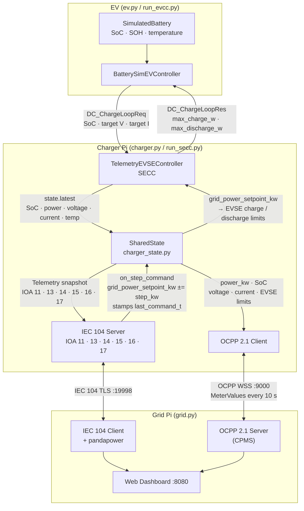

# UoL V2G Communication Protocol Prototype

A Python prototype for bidirectional Vehicle-to-Grid (V2G) energy exchange. Two Raspberry Pis (plus an EV-simulating third role) communicate over three industrial protocols to enable real-time monitoring and grid-driven control of EV charging and discharge.

For the full formal specification (session state machines, message formats, security evidence, performance validation), see [`protocol_spec.md`](protocol_spec.md).

---

## Overview

Two physical nodes run concurrently, plus an EV simulation role:

| Node | Role | Protocols |
|------|------|-----------|
| **Grid Pi** | Grid operator | IEC 104 client + OCPP 2.1 server + web dashboard |
| **Charger Pi** | EV charger (SECC) | IEC 104 server + OCPP 2.1 client + ISO 15118 SECC |
| **EV** | EV simulator (EVCC) | ISO 15118 EVCC + `SimulatedBattery` |

The grid Pi runs a pandapower load-flow on a 3-bus CIGRE network every second and sends HIGHER/LOWER step commands over IEC 104. The charger Pi translates those commands into EVSE charge-loop limits that the EV respects via ISO 15118 DC BPT.

**Sign convention used throughout:** positive power = charging (grid → EV, SoC rises); negative power = V2G discharge (EV → grid, SoC falls).


---

## Tech Stack

- **Language**: Python 3.11 (`c104` has issues on 3.13+)
- **Protocols**:
  - **IEC 60870-5-104** (`c104`): SCADA link — grid operator ↔ charger, IEC 62351-3 TLS
  - **OCPP 2.1** (`ocpp` + `websockets`): Charge point ↔ Central System management, Security Profile 3 mTLS
  - **ISO 15118-20 DC BPT** (Josev submodule + custom controllers): In-cable EV ↔ EVSE negotiation, mutual TLS 1.3 over IPv6 link-local
- **Key libraries**: `pandapower`, `fastapi`, `uvicorn`, `asyncio`

---

## Project Structure

```text
.
├── grid.py                     # Grid Pi entry point (IEC 104 client + OCPP server + dashboard)
├── charger.py                  # Charger Pi entry point — shells out to run_secc.py via Poetry
├── ev.py                       # EV entry point — shells out to run_evcc.py via Poetry
├── config.py                   # Shared config: IPs, ports, IOAs (Config dataclass, frozen)
├── run_evaluation.py           # Runs all offline evaluation tools + plots in sequence
├── code_battery_sim/           # Battery models and CSV discharge profiles
│   ├── profiles/                # time_min, soc_percent, power_kw, phase CSVs
│   └── evtype/                  # EV chemistry parameters (nominal voltage etc.)
├── code_charger/iso15118/      # Josev ISO 15118 submodule (unmodified)
├── code_cpms/                  # OCPP charge point and central system
│   └── ocpp_central_system_2.py # CPMS + _MeasuringWebSocket frame-size proxy
├── code_grid/                  # IEC 104 client, pandapower grid model, web dashboard
│   ├── iec104_panda.py          # Grid control loop (auto / manual / voltage-stab)
│   ├── iecc104_server.py        # (charger-side) IEC 104 server
│   ├── perf_logger.py           # Session performance statistics + CSV logging
│   ├── grid_state.py            # GridDashboardState singleton
│   └── web_dashboard.py         # FastAPI dashboard, port 8080
├── code_iso15118_custom/       # Custom ISO 15118 controllers and launchers
│   ├── charger_state.py        # SharedState singleton (bridges all three protocols)
│   ├── simulated_battery.py    # SimulatedBattery: coulomb-counting SoC, SOH, thermal model
│   ├── telemetry_evse_controller.py  # SECC: forwards telemetry, relays grid setpoint
│   ├── battery_ev_controller.py      # EVCC: drives SoC from battery model
│   ├── battery_profile.py      # CSV replay battery profile loader
│   ├── control_latency.py      # Setpoint → EVSE-limit control latency measurement
│   ├── iso15118_perf.py        # TCP byte-counting proxies (post-TLS EXI)
│   ├── run_secc.py             # Charger Pi launcher (full mode)
│   └── run_evcc.py             # EV simulator launcher (full mode)
├── tools/                      # Offline evaluation and analysis tools
│   ├── reliability_test.sh     # Inject packet loss via tc netem for stress testing
│   ├── analyse_reliability.py  # Parse IEC 104 CSVs and print delivery-rate table
│   ├── multi_ev_sim.py         # Discrete-event multi-EV fleet simulation (--no-v2g flag for baseline)
│   ├── battery_degradation.py  # SOH degradation comparison: charge-only vs V2G scenarios
│   ├── resource_monitor.py     # Log CPU % and memory during a live session (psutil)
│   └── plot_results.py         # Generate all evaluation figures from Logs/ CSVs
└── code_ev/                    # Placeholder (empty) — EV role covered by run_evcc.py above
```

---

## Requirements

- Python 3.11
- `pip install ocpp c104 websockets pandapower pandas fastapi uvicorn`
- `pip install matplotlib numpy psutil`  (evaluation tools only)
- `c104` may require C++ build tools on some platforms

For ISO 15118 full mode, the Josev submodule needs Poetry:
```bash
cd code_charger/iso15118
poetry install
cd iso15118/shared/pki && ./create_certs.sh -v iso-2   # one-time
```

---

## Running

### Certificate generation (one-time, run from project root)

```bash
./create_ocpp_certs.sh          # OCPP mTLS (Security Profile 3)
./create_iec104_certs.sh        # IEC 104 TLS (IEC 62351-3)
# Copy certs/ to both Pis.
```

### Simple mode (IEC 104 + OCPP only, no ISO 15118)

```bash
# Grid Pi — OCPP server + IEC 104 client + web dashboard
pip install fastapi uvicorn   # one-time
python grid.py                # dashboard at http://<grid-pi-ip>:8080

# Charger Pi — OCPP client + IEC 104 server
python charger.py
```

> `charger.py` always launches the full ISO 15118 + IEC 104 + OCPP stack by shelling out to `run_secc.py` under the Poetry virtualenv — there is no separate "simple mode" charger entry point that skips ISO 15118 entirely (see Known Limitations).

### Full ISO 15118 mode

Install the submodule dependencies first (see Requirements above), then:

```bash
# Charger Pi — SECC (combines ISO 15118 server, IEC 104 server, OCPP client)
cd code_charger/iso15118
PYTHONPATH=/path/to/UoL_V2G/code_iso15118_custom \
    poetry run python /path/to/UoL_V2G/code_iso15118_custom/run_secc.py

# EV — EVCC (ISO 15118 client with battery simulation)
cd code_charger/iso15118
PYTHONPATH=/path/to/UoL_V2G/code_iso15118_custom \
    poetry run python /path/to/UoL_V2G/code_iso15118_custom/run_evcc.py
```

Or use the convenience wrappers at the project root, which set `PYTHONPATH`/`cwd` and invoke the same scripts under Poetry automatically:

```bash
python charger.py   # SECC stack
python ev.py         # EVCC stack — forwards all EVCC_* environment variables
```

**EVCC environment variables:**

| Variable | Values / Default | Effect |
|---|---|---|
| `EVCC_CONTROLLER` | `battery` (default), `battery_csv`, `sim` | Battery model selection |
| `EVCC_PROFILE_PATH` | path to CSV | Override default LFP profile |
| `EVCC_MAX_STEPS` | integer | Cap charge loop for bounded tests |
| `EVCC_INIT_SETPOINT_KW` | float (default `17.0`) | Initial charge power before grid sends commands |
| `EVCC_TARGET_SOC` | float (default `80.0`) | SoC at which `SimulatedBattery.at_end()` returns True |

### ISO 15118 submodule tests / lint

```bash
cd code_charger/iso15118
make test           # poetry run pytest --cov
make mypy           # type checking
make code-quality   # reformat + mypy + flake8
```

---

## Architecture

### SharedState data flow (Charger Pi)

All three protocol stacks on the charger Pi converge on a single `SharedState` singleton (`code_iso15118_custom/charger_state.py`) — no protocol layer calls into another layer's code directly.



### IEC 104 control loop

The grid Pi runs two interleaved loops. The 1 s read cycle updates the pandapower model; the 4 s transmit cycle sends a step command when the grid state or battery SoC warrants it.


### SharedState fields (`charger_state.py`)

`code_iso15118_custom/charger_state.py` exports a module-level singleton `state`. All three protocol layers (ISO 15118, IEC 104, OCPP) share it:

| Field | Set by | Read by | Description |
|-------|--------|---------|-------------|
| `state.latest` | SECC (`send_charging_command`) | IEC 104 server, OCPP client | Immutable `Telemetry` snapshot: SoC, power_kw, voltage_v, current_a, soh_percent, temperature_c |
| `state.grid_power_setpoint_kw` | IEC 104 server (`on_step_command`) | SECC | Target power; clamped to `[-max_discharge_kw, +max_charge_kw]` |
| `state.command_received` | IEC 104 server (first command) | SECC | Guards against spurious full-power spike when setpoint crosses zero during a direction change |
| `state.iso_evse_max_charge_w` / `_discharge_w` | SECC (`DC_ChargeLoopRes`) | OCPP client | Last EVSE limits written into the charge-loop response; forwarded to the dashboard |
| `state.step_kw` | config (default 5.0) | IEC 104 server | Step size per HIGHER/LOWER command |
| `state.max_charge_kw` | config (default 300.0) | SECC, IEC 104 server | Maximum charge power |
| `state.max_discharge_kw` | config (default 20.0) | SECC, IEC 104 server | Maximum V2G discharge power |
| `state.last_command_t` / `state.last_command_str` | `on_step_command()` (IEC 104 callback thread) | `send_charging_command()` (asyncio loop) | Control-latency handoff: stamped the moment a step command updates the setpoint; consumed/cleared once the new EVSE limits are written into `DC_ChargeLoopRes`. The gap is the ISO 15118 charge-loop scheduling delay (see `control_latency.py`). |

**Sign convention:** positive power = charging (grid → EV); negative power = V2G discharge (EV → grid).

### IEC 104 IOA map (`config.py`)

Common Address = 47.

| IOA | Type | Direction | Meaning |
|-----|------|-----------|---------|
| 11 | M_ME_NC_1 | server → client | Active power [kW] |
| 12 | C_RC_TA_1 | client → server | Regulating step command (HIGHER/LOWER) |
| 13 | M_ME_NC_1 | server → client | State of Charge [%] |
| 14 | M_ME_NC_1 | server → client | Connector temperature [°C] (RC thermal model) |
| 15 | M_ME_NC_1 | server → client | EV target voltage [V] |
| 16 | M_ME_NC_1 | server → client | EV target current [A] |
| 17 | M_ME_NC_1 | server → client | ISO 15118 charge-loop processing time [ms] |

### Grid control logic (`iec104_panda.py`)

There are three control branches, evaluated in priority order every cycle. `auto_control`, `manual_override`, and `voltage_stab_mode` are three flags on `GridDashboardState`, all set together atomically by `POST /api/control`:

| Dashboard action | `auto_control` | `manual_override` | `voltage_stab_mode` | Mode |
|-------------------|:---:|:---:|:---:|------|
| `"auto"` | `True` | `None` | `False` | Auto |
| `"charge"` | `False` | `"HIGHER"` | `False` | Manual — force charge |
| `"v2g"` | `False` | `"LOWER"` | `False` | Manual — force V2G |
| `"voltage_stab"` | `True` | `None` | `True` | Voltage Stabilisation |

**1. Manual override** (`auto_control = False`) — dashboard button forces a continuous HIGHER or LOWER command every cycle regardless of grid state or the priority table, with no debounce. It does **not** bypass battery protection: the charger-side guard in `on_step_command()` still silently drops LOWER at/below the SoC floor and during the pre-departure charge window.

**2. Voltage stabilisation mode** (`voltage_stab_mode = True`, layered on top of `auto_control = True`) — demo mode that injects a ±80 kW sine-wave background load at bus 3 (period 60 s) before each load-flow to simulate a demand disturbance, then applies voltage-droop control:

| Condition | Command | Rationale |
|-----------|---------|-----------|
| SoC < min_soc_pct | HOLD | Battery floor — refuse V2G discharge |
| bus 2 voltage < 0.977 pu | LOWER | Droop: discharge EV → power to grid → voltage rises |
| bus 2 voltage > 0.983 pu | HIGHER | Droop: charge EV → absorbs power → voltage falls |
| 0.977–0.983 pu dead zone | HOLD | Hysteresis — avoids chattering at target |

Target voltage is 0.980 pu (`VDROOP_TARGET`); deadband is ±0.003 pu (`VDROOP_DEADBAND`). Burst count scales with deviation depth (1×/2×/4×) for LOWER commands only; HIGHER is always 1×.

**3. Auto (trafo/line threshold control)** — default mode, debounced over 2 consecutive cycles before staging a command:

| Priority | Condition | Command | Rationale |
|----------|-----------|---------|-----------|
| 1 | trafo > 80 % or line > 90 % or bus voltage < 0.95 pu | LOWER | Grid emergency — always overrides user prefs |
| 2 | SoC ≥ max_soc_pct (default 80 %) and power > 1 kW | LOWER | Battery at user max — ramp down |
| 3 | SoC < min_soc_pct (default 20 %) | HIGHER | Battery at user min — charge unconditionally |
| 4 | SoC within 3 % of max_soc_pct (approach band) | LOWER (ramping) / HIGHER (trickle) | Pre-emptive ramp to prevent ceiling overshoot |
| 5 | Departure < 60 min and SoC < target SoC | HIGHER | Charge priority — only applies when grid is not stressed |
| 6 | trafo > 73 % or line > 85 % | LOWER | Approaching capacity — reduce charge |
| 6 | trafo < 67 % and line < 75 % | HIGHER | Spare capacity — increase charge |
| 6 | 67–73 % / 75–85 % dead zones | HOLD | Hysteresis band — skip transmit so setpoint converges |

Commands are transmitted every 4 s; the IEC 104 read + pandapower cycle runs every 1 s. LOWER commands are also blocked on the SECC side (`on_step_command`) when the departure window or SoC floor conditions apply — the guard is enforced at both the command-generation layer (grid Pi) and the command-receipt layer (charger Pi).

**Why three modes exist:** Auto is the mode the system is designed to run in day-to-day, but sustained V2G export in Auto is triggered by exactly one condition (priority 1, a genuine grid emergency) — the SoC-ceiling case deliberately ramps to idle rather than falling through into discharge. On the small demo transformer, reaching that emergency organically isn't representative of a single-EV bench demo. Manual override lets bidirectional flow be demonstrated on command. Voltage Stabilisation solves the opposite problem — Auto's grid-health response is otherwise driven by a slow, mostly-monotonic charge curve that rarely produces a visible reaction in a short demo window, so the injected sine-wave disturbance manufactures a repeating, visible droop-control response. It is also the only mode with a dedicated accuracy metric (`voltage_stab_*.csv`, RMSE/MAE).

---

## User Preference Interface

Preferences are set from the dashboard's User Preferences card and propagated to the charger Pi via OCPP `SetVariables`, typically within one round-trip (< 1 s):

| Parameter | Unit | Default | Purpose |
|-----------|------|---------|---------|
| `min_soc_pct` | % | 20 | V2G floor — battery never discharged below this |
| `max_soc_pct` | % | 80 | Charge ceiling — battery not charged above this |
| `target_soc_pct` | % | 80 | Desired SoC at departure — enables departure-priority charging |
| `departure_time` | HH:MM | "" (none) | Departure window — enables pre-departure charge priority |

Invariant: `min_soc_pct < target_soc_pct ≤ max_soc_pct`.

Enforced at two independent points (defence in depth): the grid Pi's auto-control priority table (generation), and the charger Pi's `on_step_command()` guard (receipt).

---

## Web Dashboard

Served at `http://<grid-pi-ip>:8080` by `code_grid/web_dashboard.py` (FastAPI, runs as a third coroutine alongside the IEC 104 client and OCPP server in `grid.py`). Shares state via the `GridDashboardState` singleton in `code_grid/grid_state.py`.

**Data flow into the dashboard:** `iec104_panda.py` writes to `grid_state.iec104` (power, SoC, temp), `grid_state.grid` (voltage, trafo/line loading, sim_bg_load_kw), and all timing fields every cycle. `ocpp_central_system_2.py` writes to `grid_state.ocpp` (power_w, energy_wh, v2g_energy_wh, SoC, voltage_v, current_a, evse_max_charge_kw, evse_max_discharge_kw) on every MeterValues message.

### Endpoints

| Endpoint | Purpose |
|----------|---------|
| `GET /` | HTML dashboard page |
| `WS /ws` | Pushes full JSON state every 500 ms |
| `POST /api/control` | `{"action": "auto"\|"v2g"\|"charge"\|"voltage_stab"}` |
| `POST /api/tariff` | `{"charge_pence_per_kwh": float, "v2g_pence_per_kwh": float}` |
| `POST /api/preferences` | SoC limits and departure time, pushed to charger via OCPP SetVariables |
| `GET /api/perf/summary` | Full session performance statistics as JSON |
| `GET /api/perf/csv/{name}` | Download a log CSV (`iec104`, `ocpp`, `iso15118`, or `voltage_stab`) |

### Dashboard cards

- **Power Flow** — IEC 104 active power with charge/V2G direction indicator; OCPP power and energy
- **State of Charge** — SoC bar (IEC 104 + OCPP), temperature
- **Grid Health** — bus voltage, trafo %, line % from pandapower; in voltage stabilisation mode also shows voltage target and live background disturbance load (kW). **Known bug:** the card currently displays a hardcoded "0.975 pu" which does not match the controller's actual `VDROOP_TARGET = 0.980 pu` — the displayed number is stale relative to the control logic.
- **Power History** — 60 s rolling Chart.js line chart (IEC 104 kW)
- **Protocol Timing** — IEC 104 read, pandapower compute, IEC 104 transmit latencies (live, current cycle)
- **ISO 15118 Charge Loop** — EV voltage, current, V×I power; EVSE max charge/discharge limits offered in `DC_ChargeLoopRes` (sourced from OCPP `Power.Import.Offered` / `Power.Export.Offered`)
- **Security Status** — per-protocol TLS status (OCPP, IEC 104, ISO 15118): lock icon, TLS version, cert expiry. **Known bug:** hardcodes `"TLS 1.2+"` (IEC 104) / `"TLS 1.2"` (ISO 15118) because the grid Pi cannot introspect the charger-side sessions from outside those libraries — the actual negotiated version on both links is TLS 1.3, so the dashboard under-reports the achieved security level.
- **Session Billing** — configurable tariff rates (p/kWh charge and V2G export); charge energy/cost, V2G export energy/credit, net session cost. Resets on charge point reconnect.
- **Grid Demand Control** — Auto / Force V2G / Force Charge / Voltage Stabilisation buttons
- **Transmitted Command Log** — last 20 IEC 104 step commands with timestamp and source (auto/manual)
- **User Preferences** — SoC floor/ceiling/target and departure time; sent to charger via OCPP SetVariables
- **Performance Statistics** — rolling session stats (mean, min, max, p95) for IEC 104 transmit/pandapower latency, OCPP frame sizes/handler time, ISO 15118 loop time, plus the four theoretical IEC 104 APDU sizes as a static reference; CSV download links for each log file

### Control modes (`POST /api/control`)

| Action | Behaviour |
|------|-----------|
| `"auto"` | Restores pandapower trafo/line threshold control (`auto_control=True`, `voltage_stab_mode=False`) |
| `"v2g"` | Manual continuous LOWER (`auto_control=False`, `manual_override="LOWER"`) |
| `"charge"` | Manual continuous HIGHER (`auto_control=False`, `manual_override="HIGHER"`) |
| `"voltage_stab"` | Voltage-droop demo: injects sine-wave background load, V2G tracks bus 2 voltage to 0.980 pu (`auto_control=True`, `voltage_stab_mode=True`) |

---

## Performance Logging (`code_grid/perf_logger.py`)

A module-level singleton `perf_logger` accumulates session statistics and writes append-only CSV files to `Logs/`. Imported by `iec104_panda.py`, `ocpp_central_system_2.py`, and `web_dashboard.py`.

### CSV files

| File | Written by | Columns |
|------|-----------|---------|
| `iec104_YYYYMMDD_HHMMSS.csv` | `iec104_panda.py` every 4 s transmit | `timestamp_unix, timestamp_iso, cmd, bursts, success, transmit_ms, read_ms, pandapower_ms, cycle_ms` |
| `ocpp_YYYYMMDD_HHMMSS.csv` | `_MeasuringWebSocket` (frame sizes) + `on_meter_values` (handler time) | `timestamp_unix, timestamp_iso, direction, msg_type, size_bytes, processing_ms` |
| `iso15118_YYYYMMDD_HHMMSS.csv` | `iec104_panda.py` every 4 s (reads IOA 17) | `timestamp_unix, timestamp_iso, loop_ms, voltage_v, current_a, power_kw, soc_pct` |
| `iso15118_bytes_YYYYMMDD_HHMMSS.csv` | `iso15118_perf.py` on every TCP read/write | `timestamp_unix, timestamp_iso, direction, size_bytes, cumulative_rx_bytes, cumulative_tx_bytes` |
| `voltage_stab_YYYYMMDD_HHMMSS.csv` | `iec104_panda.py` every 1 s read cycle, only when `voltage_stab_mode=True` | `timestamp_unix, timestamp_iso, bus2_voltage_pu, setpoint_pu, error_pu, bg_load_kw, cmd` |
| `control_latency_YYYYMMDD_HHMMSS.csv` | `control_latency.py` (charger Pi SECC process) | `timestamp_unix, timestamp_iso, cmd, setpoint_kw, latency_ms` |

`voltage_stab_*.csv` is created with headers at startup but contains no data rows for sessions that never activated voltage stabilisation mode.

### OCPP MeterValues measurands

Sent every 10 s by `ocpp_charge_point_2.py`:

| Measurand | Unit | Source |
|-----------|------|--------|
| `Power.Active.Import` | W | `state.latest.power_kw × 1000` (negative = V2G) |
| `Energy.Active.Import.Register` | Wh | Session charge accumulator (positive power only; resets on reconnect) |
| `SoC` | % | `state.latest.soc_percent` |
| `Voltage` | V | EV target voltage from `DC_ChargeLoopReq` |
| `Current.Import` | A | EV target current from `DC_ChargeLoopReq` |
| `Power.Import.Offered` | W | `state.iso_evse_max_charge_w` (EVSE charge limit in `DC_ChargeLoopRes`) |
| `Power.Export.Offered` | W | `state.iso_evse_max_discharge_w` (EVSE discharge limit in `DC_ChargeLoopRes`) |

`v2g_energy_wh` is **not** a measurand — it is accumulated on the CPMS side by integrating `|power_w| × Δt` whenever `power_w < 0` between successive MeterValues messages. Both `energy_wh` and `v2g_energy_wh` reset to zero in `on_boot_notification`.

### IEC 104 theoretical APDU sizes

The `c104` library does not expose raw byte counts; sizes are derived from IEC 60870-5-104:

| APDU type | Bytes | Breakdown |
|-----------|-------|-----------|
| `C_RC_TA_1` (step command) | 23 | APCI(6) + ASDU header(6) + IOA(3) + RCO(1) + CP56Time2a(7) |
| `M_ME_NC_1` (float measurement) | 20 | APCI(6) + ASDU header(6) + IOA(3) + ShortFloat(4) + Quality(1) |
| U-frame (session management) | 6 | APCI only |
| S-frame (supervisory ack) | 6 | APCI only |

### Throughput rate counters

`_RateCounter` tracks a 60-second sliding window of (timestamp, bytes) pairs:

| Counter | Protocol | What is counted |
|---------|----------|----------------|
| `perf_logger.iec104_rate` | IEC 104 | Bytes per successful non-HOLD transmit burst (`23 × bursts`) |
| `perf_logger.ocpp_incoming_rate` | OCPP | Actual UTF-8 byte length of each incoming WebSocket frame |
| `perf_logger.ocpp_outgoing_rate` | OCPP | Actual UTF-8 byte length of each outgoing WebSocket frame |
| `perf_logger.iso_rate` | ISO 15118 | Charge-loop iterations (byte count captured separately in `iso15118_perf.py`) |

Each exposes `{"msgs_per_sec", "bytes_per_sec", "window_s", "sample_count"}` via `.to_dict()`, included in `get_summary()` per-protocol and in `get_live_stats()` as `iec104_throughput`, `ocpp_incoming_throughput`, `ocpp_outgoing_throughput`, `iso_throughput`.

### Voltage stabilisation accuracy

`get_summary()["voltage_stab"]`, populated only when `voltage_stab_mode` is active: `count` (1 s samples), `rmse_pu`, `abs_error_pu` (mean/min/max/p95 of |error|). Setpoint `VDROOP_TARGET = 0.980 pu`; deadband ±`VDROOP_DEADBAND = 0.003 pu`.

### Control latency measurement (`control_latency.py`)

Measures the end-to-end control latency on the charger Pi: the time from `on_step_command()` updating `state.grid_power_setpoint_kw` to `TelemetryEVSEController.send_charging_command()` applying the new EVSE limits in the next `DC_ChargeLoopRes`. Captures the ISO 15118 charge-loop scheduling delay (how long until the EV sends the next `DC_ChargeLoopReq`).

1. `on_step_command()` stamps `state.last_command_t = time.monotonic()` and `state.last_command_str` after updating the setpoint (skipped if the SoC floor or departure-window guard ignores the command — latency is only meaningful when the setpoint actually changes).
2. `send_charging_command()` checks `state.last_command_t > 0` after writing EVSE limits; if set, computes `latency_ms`, logs it, and clears the flag.

In-memory summary: `control_latency.get_summary()` → `{"count", "mean_ms", "min_ms", "max_ms", "p95_ms", "log_path"}`. This is a same-process measurement (both sides run in the SECC process) — it does not include IEC 104 network transit time from the grid Pi, which would require NTP-synchronised clocks across both Pis.

---

## ISO 15118 Custom Layer (`code_iso15118_custom/`)

The upstream Josev repo (`code_charger/iso15118`) is not modified. Custom behaviour is injected via subclasses, monkey-patching, and launchers:

- **`TelemetryEVSEController`** — subclasses `SimEVSEController`; overrides `send_charging_command()` to bridge ISO 15118 ↔ SharedState. On each `DC_ChargeLoopReq` it updates `state.latest` and computes EVSE limits via `_grid_setpoint_to_evse_limits()`, using `state.command_received` to guard against a spurious full-power spike when the setpoint crosses zero during a direction change. Pack temperature for IOA 14 is read from `EVCC_TEMP_FILE` (`/tmp/v2g_pack_temperature`), written by the EVCC on each `advance()` call; falls back to 25.0 °C until the first EVCC tick.
- **`BatterySimEVController`** — subclasses `SimEVController`; drives SoC from a `BatteryProfile` (CSV replay or live `SimulatedBattery`). `update_evse_limits()` is called on each `DC_ChargeLoopRes` to set the battery's power target. After each `advance()`, the pack temperature from `BatteryState.temperature_c` is written to `EVCC_TEMP_FILE`.
- **`SimulatedBattery`** — integrates SoC by coulomb-counting, models SOH degradation via cumulative throughput (EFC), and models pack temperature via an RC thermal model (ambient + R_th × |P_kW|, τ = 300 s). No `c104`/`iso15118` imports — unit-testable standalone. Constructed in `run_evcc.py` with `max_charge_kw=300.0` and `max_discharge_kw=20.0` to match `SharedState` limits.
- **`iso15118_perf.py`** — `CountingStreamReader`/`CountingStreamWriter` wrap the asyncio stream reader/writer to count bytes without touching upstream code (`run_secc.py` patches `TCPServer.__call__`; `run_evcc.py` patches `TCPClient.create`). Writes `Logs/iso15118_bytes_YYYYMMDD_HHMMSS.csv`; bytes counted are post-TLS EXI-encoded application-layer data, not total wire size.
- **`control_latency.py`** — see Performance Logging above.
- Launchers (`run_secc.py`, `run_evcc.py`) inject these controllers without touching the upstream tree.

### Battery profiles (`code_battery_sim/profiles/`)

CSV columns: `time_min, soc_percent, power_kw, phase`. Phase values: `ramp`, `charge`, `hold`, `discharge`, `done`. The final row(s) must carry `phase == done` to terminate the charge loop. EV chemistry parameters (nominal voltage etc.) live in `code_battery_sim/evtype/*.csv`.

---

## Battery Management Formulae

**SoC — coulomb counting**, applied each tick:

```
ΔSoC [%] = (P_kW × dt_h × η) / (E_nom_kWh × SOH) × 100

  P_kW  = delivered power (+charge / −discharge)
  dt_h  = time step in hours
  η     = charge efficiency = 0.98 (charging only)
  E_nom = nominal pack capacity [kWh] (default 82.5 kWh, BYD LFP)
  SOH   = state of health fraction [0–1]
```

At the SoC ceiling/floor, the delivered fraction of the step is prorated so SoC lands exactly on the boundary.

**SOH — throughput cycle-aging model:**

```
EFC = cumulative_throughput_kWh / (2 × E_nom_kWh)
SOH = 1 − (1 − SOH_eol) × (EFC / cycle_life)

  SOH_eol    = 0.80 (end-of-life convention)
  cycle_life = 5000 (LFP equivalent full cycles to end-of-life; realistic value)
```

Throughput accumulates as `|actual_power_kW| × dt_h` regardless of direction.

**Connector thermal model (SECC side, RC model):**

```
T_target  = T_amb + R_th × |P_kW|
ΔT        = (T_target − T_current) × (1 − exp(−dt_s / τ))
T_current += ΔT

  T_amb = 25°C, R_th = 0.05 °C/kW, τ = 300 s
```

Reported via IOA 14 / `state.latest.temperature_c`. Models the SECC-side cable/connector, not the battery pack — the EVCC has a separate, independent thermal model for the pack.

**Battery protection limits:**

| Condition | Effect |
|-----------|--------|
| SoC ≥ ceiling (100%) and charging | Charging clamped to zero |
| SoC ≤ floor (20%) and discharging | Discharge clamped to zero; floor held exactly |
| `setpoint > max_charge_kw` (300 kW) | Setpoint clamped to `max_charge_kw` |
| `setpoint < −max_discharge_kw` (−20 kW) | Setpoint clamped to `−max_discharge_kw` |

The 20% SoC floor is the hard physical limit built into `SimulatedBattery`. The user preference `pref_min_soc_pct` (also defaulting to 20%) is a separate grid-control guard enforced in the IEC 104 step-command handler and the pandapower control algorithm.

---

## Security Architecture

A single shared CA certificate is used across all three protocols:

```
Root CA (ca.crt)
├── IEC 104 server cert  (certs/iec104/server.crt)  — charger Pi
├── IEC 104 client cert  (certs/iec104/client.crt)  — grid Pi
├── OCPP CSMS cert       (certs/ocpp/csms.crt)      — grid Pi
├── OCPP CP cert         (certs/ocpp/cp.crt)         — charger Pi
├── ISO 15118 SECC cert  (pki/secc/)                 — charger Pi
└── ISO 15118 EVCC cert  (pki/evcc/)                 — charger Pi (EVCC simulation)
```

| Protocol | Version | Authentication | Port |
|----------|---------|---------------|------|
| ISO 15118 | TLS 1.3 | Mutual (EVCC ↔ SECC) | Dynamic (SDP-discovered), IPv6 link-local |
| OCPP 2.1 | TLS 1.3 (WSS) | Mutual — Security Profile 3 | 9000 |
| IEC 60870-5-104 | TLS 1.3 (IEC 62351-3) | Mutual (Client ↔ Server) | 19998 |

All three links enforce mutual authentication — both parties present and validate certificates against the shared CA; an unauthenticated endpoint cannot inject commands or read telemetry. Live-session log evidence (mbedTLS debug output for IEC 104, SDP+TLS handshake pairs for ISO 15118, and an explicit TLS-info log line for OCPP) confirming TLS 1.3 was actually negotiated — not just configured — is documented in `protocol_spec.md` §11.4 and §15.4.

Generate certificates:
```bash
./create_ocpp_certs.sh
./create_iec104_certs.sh
cd code_charger/iso15118/iso15118/shared/pki && ./create_certs.sh -v iso-2
```

---

## Evaluation Tools (`tools/`)

`run_evaluation.py` at the project root runs the multi-EV, degradation, and (if logs exist) reliability tools in sequence and generates all plots in one command (`python run_evaluation.py`, `--quick` for a fast smoke test). The tools can also be run individually:

### Reliability stress testing

```bash
sudo ./tools/reliability_test.sh --iface eth0 --loss 5 --duration 300
sudo ./tools/reliability_test.sh --remove --iface eth0   # clean up if needed
```

Injects packet loss on the IEC 104 interface via `tc netem` (requires `iproute2`, root, on the grid Pi). Run once per scenario (0%, 5%, 20%), then copy the resulting `Logs/iec104_*.csv` with the loss rate in the filename.

```bash
python tools/analyse_reliability.py \
    Logs/iec104_loss0.csv Logs/iec104_loss5.csv Logs/iec104_loss20.csv \
    --labels "0% loss" "5% loss" "20% loss"

python tools/analyse_reliability.py --dir Logs/   # auto-discover all iec104_*.csv
```

Output includes transmit/success cycles, delivery rate %, mean burst count, mean/p95 transmit latency, mean pandapower latency, HIGHER/LOWER split, and degradation deltas vs the baseline. Writes `Logs/reliability_summary.csv`.

### Multi-EV scalability simulation

```bash
python tools/multi_ev_sim.py --fleet 1 5 10 20 --ticks 1800 --dt 4.0

# Baseline (charge-only, no V2G discharge) for comparison:
python tools/multi_ev_sim.py --fleet 1 5 10 20 --no-v2g
```

Fast-forward discrete-event simulation of N EVs sharing a single IEC 104 control channel; rebuilds the pandapower network inline to avoid importing `iec104_panda.py` (which requires the `c104` embedded library). Each tick = 4 s. Control logic mirrors `iec104_panda.py`: priority table, adaptive burst count, 2-cycle debounce streak, proportional dispatch (`step_per_ev = STEP_KW / N`). Ceiling control uses `max_soc` (most-charged EV). The `--no-v2g` flag clamps all setpoints to ≥ 0 kW; output files are tagged `_nov2g` so both run types can coexist in `Logs/`.

Per-tick CSV columns: `tick, sim_min, ev0_soc_pct…evN_soc_pct, mean_soc_pct, total_power_kw, bus2_voltage_pu, trafo_loading_pct, line_loading_pct, cmd, bursts, cumulative_higher, cumulative_lower, grid_stress`. Summary dict includes a `v2g_enabled` boolean.

The pre-emptive approach-band ramp-down used in the live controller is intentionally omitted here — in the discrete simulation it causes HIGHER/LOWER oscillation that prevents SoC from crossing the ceiling.

### Battery degradation analysis

```bash
python tools/battery_degradation.py                          # default: 800 cycles, cycle_life=200
python tools/battery_degradation.py --n-cycles 500 --cycle-life 200
python tools/battery_degradation.py --no-plot                # CSV output only
```

Validates the throughput-based SOH cycle-aging model by comparing three usage profiles:

| Scenario | Charge to | Discharge to | Cycles to EOL (cycle_life=200) |
|----------|-----------|-------------|-------------------------------|
| `charge_only` | 80 % | — | ~730 |
| `moderate_v2g` | 80 % | 30 % | ~400 |
| `heavy_v2g` | 80 % | 20 % (floor) | ~370 |

Heavy V2G roughly halves battery session life vs charge-only. `cycle_life=200` is an accelerated demo; pass `--cycle-life 5000` for physics-accurate results (requires more cycles to see visible degradation).

CSV columns: `cycle, soh_pct, throughput_kwh, efc, energy_in_kwh, energy_out_kwh, peak_temp_c, end_temp_c`.

| Option | Default | Effect |
|--------|---------|--------|
| `--n-cycles` | 800 | Maximum cycles per scenario (stops early at EOL) |
| `--cycle-life` | 200 | EFC to 80% SOH (accelerated demo; realistic LFP = 5000) |
| `--capacity` | 82.5 kWh | Pack usable capacity |
| `--charge-kw` | 50.0 | Charge power [kW] |
| `--discharge-kw` | 20.0 | V2G discharge power [kW] |
| `--dt` | 30.0 s | Integration timestep (30 s is fast; 4 s matches live system) |
| `--no-plot` | — | Skip matplotlib output; CSV only |

### Resource efficiency monitoring

```bash
python tools/resource_monitor.py --interval 5
python tools/resource_monitor.py --process grid.py --process charger.py --interval 5
python tools/resource_monitor.py --duration 600 --process grid.py
python tools/resource_monitor.py --plot-only Logs/resource_20240101_120000.csv
```

Logs system CPU % and memory during a V2G session — evidence of lightweight operation on constrained hardware. Requires `psutil`. The first CPU sample is always 0.0 (psutil design) and is discarded by priming before the measurement loop.

Output: `Logs/resource_{SESSION}.csv`. Columns: `timestamp_unix, timestamp_iso, system_cpu_pct, system_mem_used_mb, system_mem_available_mb[, {name}_pid, {name}_cpu_pct, {name}_rss_mb]`.

### Plotting (`tools/plot_results.py`)

Generates publication-quality figures from all evaluation outputs, written to `Logs/plots/` (`--out-dir` to override, `--dpi 300` for print quality).

```bash
python tools/plot_results.py reliability Logs/iec104_loss0.csv Logs/iec104_loss5.csv Logs/iec104_loss20.csv \
    --labels "0% loss" "5% loss" "20% loss" --dpi 300
python tools/plot_results.py reliability --summary Logs/reliability_summary.csv
python tools/plot_results.py multi-ev Logs/multi_ev_*ev_20240101_*.csv
python tools/plot_results.py multi-ev --summary Logs/multi_ev_summary_20240101_120000.csv \
    --no-v2g-summary Logs/multi_ev_summary_nov2g_20240101_120001.csv
python tools/plot_results.py degradation Logs/degradation_*_20240101_120000.csv
python tools/plot_results.py resource Logs/resource_20240101_120000.csv
python tools/plot_results.py voltage-stab Logs/voltage_stab_20240101_120000.csv
python tools/plot_results.py voltage-stab --dir Logs/   # auto-discover
python tools/plot_results.py latency --dir Logs/        # auto-discover latest of each
python tools/plot_results.py all --dir Logs/ --dpi 300  # everything
```

| Subcommand | Input | Output figures |
|------------|-------|----------------|
| `reliability` | `iec104_*.csv` or `reliability_summary.csv` | `reliability_delivery_rate.png`, `reliability_latency.png`, `reliability_latency_dist.png`, `reliability_command_mix.png`, `reliability_latency_timeseries.png` |
| `latency` | `iec104_*.csv` + `control_latency_*.csv` + `iso15118_*.csv` (any subset; `--dir` auto-discovers) | `latency_validation.png` — 2×2 histogram grid: IEC 104 transmit, pandapower compute, control latency, ISO 15118 loop; mean/p95 annotated |
| `multi-ev` | `multi_ev_*ev_*.csv` or `multi_ev_summary_*.csv` | `multiev_soc_traces.png`, `multiev_grid_health.png`, `multiev_power_overlay.png`, `multiev_scalability.png` |
| `multi-ev --no-v2g-summary` | + `multi_ev_summary_nov2g_*.csv` | additionally `multiev_v2g_comparison.png` |
| `degradation` | `degradation_*.csv` | `degradation_soh.png`, `degradation_temperature.png` |
| `resource` | `resource_*.csv` | `resource_usage.png` (per CSV) |
| `voltage-stab` | `voltage_stab_*.csv` | `voltage_stab_{SESSION}.png` (per CSV) — voltage time series + error histogram; RMSE/MAE printed to stdout |
| `all` | auto-discover `Logs/` | all of the above |

`reliability`'s plotting function takes `--scenario-label` (default `"Session"`, neutral) — pass `"Packet Loss Scenario"` once genuine labelled loss-injection CSVs exist. `cmd_reliability`/`cmd_all` drop 0-transmit-cycle sessions before plotting. `all` separates V2G/no-V2G per-tick CSVs by the `_nov2g_` filename tag and auto-discovers `voltage_stab_*.csv`.

Requires `pip install matplotlib numpy`.

---

## Configuration

All network addresses and IOAs are in `config.py` (`Config` dataclass, frozen):

| Field | Meaning |
|-------|---------|
| `IP_ADDRESS` | Charger Pi IP (IEC 104 server) |
| `OCPP_SERVER` | `"<ip>:<port>"` of the grid Pi |
| `PORT` | 2404 (IEC 104 standard port; deployment uses 19998 over TLS, see Security Architecture) |
| `COMMON_ADDRESS` | 47 |

Cross-subnet OCPP tunnel:
```bash
ssh -L 9000:localhost:9000 <user>@<grid-pi-host> -N
```

---

## Protocol Specification

`protocol_spec.md` in the project root is the formal protocol specification document. It covers OSI layer mapping for all three protocols, session lifecycle state machines, message format tables (IOA map, OCPP measurands, ISO 15118 DC charge loop fields), SharedState integration contracts, the security model (TLS profiles, certificate hierarchy, live log evidence of negotiated TLS versions), performance requirements, battery management formulae, and known limitations — written to be readable independently of the code. It also includes a **Validation and Results** section (§15) with measured latency/throughput/reliability/scalability figures from live sessions, e.g.:

- Control latency (IEC 104 setpoint → EVSE limit applied): mean 248.7 ms, p95 615.3 ms (n=1057, dominated by ISO 15118 charge-loop scheduling interval, not network transit)
- IEC 104 command transmit: mean 8.7 ms, p95 14.8 ms (n=1069)
- Delivery rate: 100.00% across all logged sessions to date (clean-link baseline — no packet loss has yet been injected via `tools/reliability_test.sh`)
- Multi-EV scalability: fleets of 1/5/10/20 EVs reach 80% SoC in 14.1/32.8/59.4/(none in 120 min) minutes respectively; N=20 drives peak transformer loading to 137.8%, an intentional infrastructure-overload finding at the prototype's 0.4 MVA transformer scale

See `protocol_spec.md` §15 for full methodology, source files, and caveats.

---

## Known Limitations / Out of Scope

- `code_ev/` directory is intentionally empty — the EV role is covered by the EVCC in `code_iso15118_custom/` (launched via `ev.py` → `run_evcc.py`).
- `charger.py` launches the full ISO 15118 + IEC 104 + OCPP stack by shelling out to `run_secc.py` under the Poetry virtualenv; there is no separate "simple mode" charger entry point.
- Temperature IOA 14 (`state.latest.temperature_c`) is sourced from `SimulatedBattery.temperature_c` on the EVCC side, written to `/tmp/v2g_pack_temperature` after each `advance()` and read by the SECC. In `CsvProfile` (CSV replay) mode, temperature defaults to 25.0 °C because replay profiles carry no thermal state.
- ISO 15118 byte counts in `iso15118_perf.py` are post-TLS EXI payload bytes, not total wire bytes — TLS record overhead (~20–30 B per record) is excluded because `asyncio.StreamReader`/`StreamWriter` sit above the TLS layer.
- Multi-EV scalability is simulation-only (`tools/multi_ev_sim.py`). Proportional dispatch with max-SoC ceiling control means only one EV typically completes charging per scenario before fleet-wide ramp-down triggers. N=20 exceeds the prototype's 400 kVA transformer capacity — a valid infrastructure-overload finding, not a simulation bug.
- Reliability stress testing uses synthetic packet loss (`tc netem`) rather than real adverse network conditions. The IEC 104 `success` field records whether `command.transmit()` returned without exception, not confirmed ASDU receipt. Delivery-rate/reliability tracking exists only for IEC 104 — OCPP and ISO 15118 both ride over TCP, which already guarantees ordered delivery or drops the connection outright, so there's no per-message "silently lost" event comparable to IEC 104's burst-and-retry commands to log.
- Battery degradation in `tools/battery_degradation.py` uses `cycle_life=200` by default for a visually clear demo. Realistic LFP packs have `cycle_life=5000`; pass `--cycle-life 5000` for physics-accurate results.
- Resource monitoring in `tools/resource_monitor.py` requires `psutil`. CPU % is averaged since the last call; the first sample is always 0.0 (psutil design) and is discarded by priming before the measurement loop.
- Control latency in `control_latency.py` is a same-process measurement on the charger Pi. It does not include IEC 104 network transit time from the grid Pi — capturing that would require NTP-synchronised clocks and correlated logs from both Pis.
- `voltage_stab_*.csv` is only written during `voltage_stab_mode` sessions; the file is created with headers at startup but contains no data rows otherwise.
- **Dashboard voltage-target display bug:** the Grid Health card hardcodes "0.975 pu" as the voltage-stabilisation target; the actual controller constant (`VDROOP_TARGET`) is 0.980 pu.
- **Dashboard TLS-version display bug:** the Security Status card hardcodes `"TLS 1.2+"` (IEC 104) / `"TLS 1.2"` (ISO 15118) because the grid Pi has no live introspection into the charger-side sessions. The actual negotiated version on both links is TLS 1.3 — the dashboard under-reports the achieved security level.
- Energy export metering (`v2g_energy_wh`) is accumulated on the CPMS side by integrating negative MeterValues frames — it is not a certified revenue-grade measurement.
- SOH verification uses the simplified throughput method; capacity verification requiring a full charge/discharge cycle is not implemented.

---

## License

TODO: Add license information.
